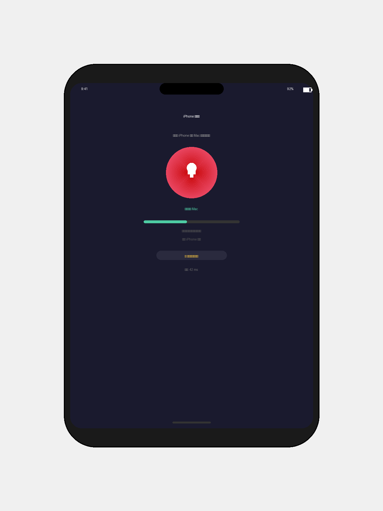

# iPhone 无线麦克风 / iPhone Wireless Mic

把你的 iPhone 变成 Mac 的无线麦克风。音频通过 Wi-Fi 实时传输到 Mac，并借助
BlackHole 2ch 虚拟声卡注册为系统级输入设备，任何 App（Codex、Zoom、录音机等）
都可以直接使用。



## 音频链路

```
iPhone 麦克风 → Safari → HTTPS POST → server.py → bh_player → BlackHole 2ch → 任何 App
```

## 音频格式约定

- 采样率：44100 Hz
- 声道：单声道（mono）
- 位深：16-bit signed little-endian PCM

前端在 `static/index.html` 中采集上述格式，`bh_player` 读取同样的格式并把单声道
复制为双声道、Int16 转为 Float32 后写入 BlackHole。

## 前置依赖

1. macOS + Xcode Command Line Tools（提供 `swiftc` 编译 `bh_player`）
   ```bash
   xcode-select --install
   ```
2. Python 3（macOS 自带 `/usr/bin/python3`）
3. [BlackHole 2ch](https://existential.audio/blackhole/) 虚拟声卡
   ```bash
   brew install blackhole-2ch
   ```

> 注意：`bh_player` 完全由源码编译，不需要也不应该依赖 `/tmp` 下的临时二进制。

## 快速开始

```bash
cd iphone-mic
./start.command
```

`start.command` 会自动：

1. 检查 Python；
2. 检查 BlackHole 2ch；
3. 如果 `bin/bh_player` 不存在则自动编译；
4. 启动 `server.py`（它再启动 `bh_player`）；
5. 打印 Mac 的 IP 和端口。

然后在 iPhone 上：

1. 确保 iPhone 与 Mac 在同一个 Wi-Fi；
2. Safari 打开 `https://[Mac IP]:8080`；
3. 忽略自签名证书警告；
4. 点击麦克风按钮并允许权限。

## 手动构建与启动

只构建播放器：

```bash
./scripts/build_player.sh
```

前台启动服务器（适合终端或 launchd）：

```bash
./start.sh
```

也可以直接运行：

```bash
python3 server.py
```

## 开机自动启动

安装 launchd 自启任务（登录时启动，进程退出自动重启）：

```bash
./scripts/install_launchd.sh
```

卸载：

```bash
./scripts/uninstall_launchd.sh
```

> 重要：本项目位于 `~/Documents`，macOS 的 TCC 隐私保护默认阻止 launchd
> LaunchAgent 访问该目录。若自启失败，请选择其一：
>
> 1. 在「系统设置 → 隐私与安全性 → 完全磁盘访问权限」中为 `/bin/bash`
>    添加权限；
> 2. 或把整个项目移动到不受 TCC 保护的目录，例如
>    `~/Library/Application Support/iphone-mic`，然后重新运行安装脚本。

## 确认音频已经进入 BlackHole

1. 保持服务器运行，iPhone 处于传输状态；
2. 打开「系统设置 → 声音 → 输入」，选择 **BlackHole 2ch**；
3. 打开「语音备忘录」或 Codex 语音输入，正常说话，若能看到波形或文字，
   说明音频已经进入系统；
4. 也可用命令行确认 BlackHole 被设为 44100 Hz：

   ```bash
   system_profiler SPAudioDataType | grep -A 3 "BlackHole"
   ```

## 项目结构

```
iphone-mic/
├── bh_player.swift            # Swift 播放器源码（stdin PCM → BlackHole）
├── server.py                  # Python HTTPS 服务器
├── static/
│   └── index.html             # iPhone 网页（采集 + Wake Lock）
├── scripts/
│   ├── build_player.sh        # 编译 bh_player
│   ├── install_launchd.sh     # 安装开机自启
│   └── uninstall_launchd.sh   # 卸载开机自启
├── start.command              # 一键启动（交互式，Enter 停止）
├── start.sh                   # 前台启动（终端 / launchd 入口）
├── bin/                       # 编译产物（git 忽略）
├── cert.pem / key.pem / cert.conf
└── screenshot.png
```

## 常见问题

**Q: 网页能打开、显示“正在传输”，但 Mac 没有声音？**

1. 确认 `bh_player` 正在运行：`ps aux | grep bh_player`；
2. 确认系统输入设备选的是 BlackHole 2ch；
3. 确认 BlackHole 采样率是 44100 Hz；
4. 若 `bin/bh_player` 缺失，运行 `./scripts/build_player.sh`。

**Q: iPhone 锁屏后中断？**

iOS 锁屏会强制停止麦克风。页面使用 Screen Wake Lock API 尽量保持屏幕常亮。

**Q: 延迟大吗？**

局域网下约 50–200ms，语音输入足够。

## License

MIT
